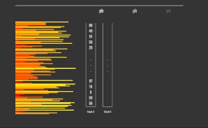

<h1 align="center">
	PUSH_SWAP(Projects at 42tokyo)
</h1>

<p align="center">
	<b><i>Final Score 91/100</i></b><br>
</p>

## 💡 About the project

> The Push swap project is a very simple and a highly straightforward algorithm project:
data must be sorted.
You have at your disposal a set of integer values, 2 stacks, and a set of instructions
to manipulate both stacks.
Your goal? Write a program in C called push_swap which calculates and displays
on the standard output the smallest program, made of Push swap language instructions,
that sorts the integers received as arguments.


The task is to sort a sequence of integers given as command line arguments. The following constraints are specified

* Only two stacks, Stack_a and Stack_b, may be used for sorting.
* Stack operations must be limited to the 11 specified commands.
* Appropriate error handling must be implemented to deal with unexpected input (memory leaks and segmentation faults are not allowed).

Other detailed rules exist...

### The 11 specified commands

| instructions  | Description   |
|:-------------:|---------------|
| sa            | Swap the first two elements of Stack_a |
| sb            | Swap the first two elements of Stack_b |
| ss            | Swap the first two elements of both Stack_a and Stack_b |
| pa            | Move the first element of Stack_b to the top of Stack_a |
| pb            | Move the first element of Stack_a to the top of Stack_b |
| ra            | Rotate all elements of Stack_a up by one (the first element moves to the bottom) |
| rb            | Rotate all elements of Stack_b up by one (the first element moves to the bottom) |
| rr            | Rotate all elements of both Stack_a and Stack_b up by one |
| rra           | Rotate all elements of Stack_a down by one (the last element moves to the top) |
| rrb           | Rotate all elements of Stack_b down by one (the last element moves to the top) |
| rrr           | Rotate all elements of both Stack_a and Stack_b down by one |

## Supplementary Information:

For this project, the use of the following standard functions is permitted:
`read`, `write`, `malloc`, `free`, `exit`

If you need to use any other functions, you must implement them yourself.

Therefore, I used my custom library [Libft](https://github.com/jayjayjay-hub/libft), 

# 🚀 Algorithm

Divide the cases based on the number of given numbers.

→ For a small number of elements, it's more efficient to describe the rules explicitly (hardcoding).

## For 3 or fewer elements

1. element: Do nothing
2. elements: Swap if necessary
3. elements: Hardcode the sorting logic

## For 4 elements

1. Push the smallest number to Stack B
2. Sort the remaining 3 elements using the 3-element sorting algorithm
3. Push the smallest number from Stack B back to Stack A

## For 5 or more elements

Use the following algorithm:

1. Push elements to Stack B until Stack A has 3 or fewer elements
   Conditions for pushing:
   * If the element is greater than the maximum or less than the minimum in Stack B, push it above the maximum in Stack B.
     Rotate Stack B until the maximum is at the top.
   * Otherwise, push it above the element in Stack B that is closest to and smaller than it.
   
   Select the element from Stack A that requires the fewest commands to satisfy these conditions and push it to Stack B.

2. Sort Stack A once it has 3 or fewer elements

3. Push all elements from Stack B back to Stack A
   Conditions for pushing (reverse of step 1):
   * If the element is greater than the maximum or less than the minimum in Stack A, push it above the minimum in Stack A.
     Otherwise, push it above the element in Stack A that is closest to and larger than it.
   * Select the element from Stack B that requires the fewest commands to satisfy these conditions and push it to Stack A.

4. Rotate Stack A until it is in ascending order


## 🛠️ Usage

### Requirements

The library is written in C language and needs the **`cc` compiler**.

### Instructions

**1. Compiling the code**

To compile the  libft library and this project code, go to its path and run:

```shell
$ make
```

**2. Run**
After creating the executable file push_swap, you provide the numbers you want to sort as command line arguments.

```shell
./push_swap 2 4 1 6 4
```

**+α. Cleaning all binary (.o) and executable files**

To clean all files generated while doing a make, go to the path and run:

```shell
$ make fclean
```


